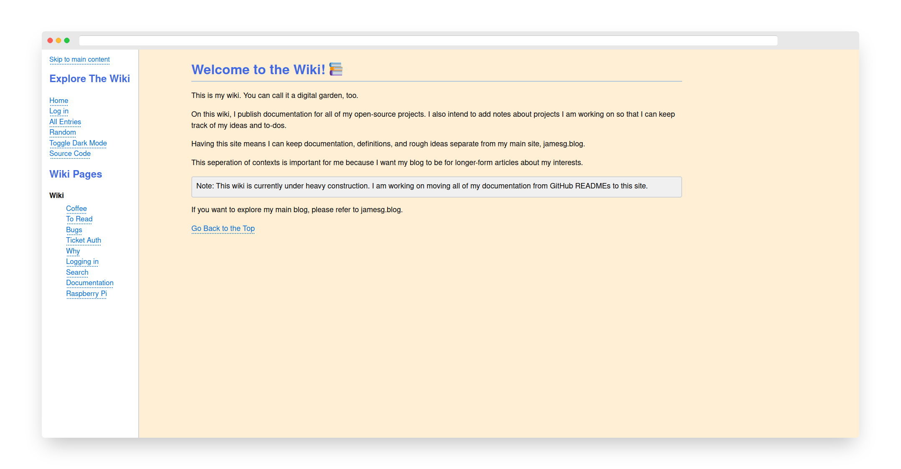

# James' Wiki

This repository contains the code for my personal wiki. I use my personal wiki to document all pieces of information I want to retain for a later date.

*This project is currently under construction.*

## Screenshot

## Features

This wiki is built to cater to my personal documentation needs. The wiki currently supports the following features:

- Showing wiki pages
- Sign in with IndieAuth
- Creating new wiki pages
- Updating existing wiki pages
- Deleting wiki pages
- Documenting revisions that can be viewed later
- Searching for text in a wiki entry
- Dark mode

All wiki entries can be written in markdown or HTML.

## Installation

To use this project, first set up a virtual environment and install the required dependencies. You can do this using the following commands:

    python3 -m venv venv
    source venv/bin/activate
    pip -r install requirements.txt

Next, you will need to prepare the project database. You can do this by running the seed program:

    python3 seed.py

This program will create the database tables you need to run the wiki.

Next, run the Python web server:

    export FLASK_APP=.
    flask run

Your wiki will be available at localhost:5000.

## Technologies

This project is built with the following tools and technologies:

- Python
- Flask
- difflib
- sqlite3

## Licence

This project is licensed under the [MIT License](LICENSE)

## Contributors

- capjamesg